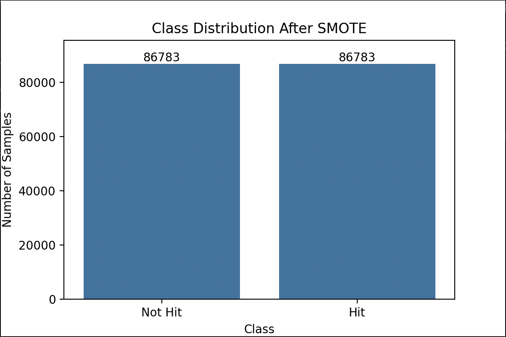
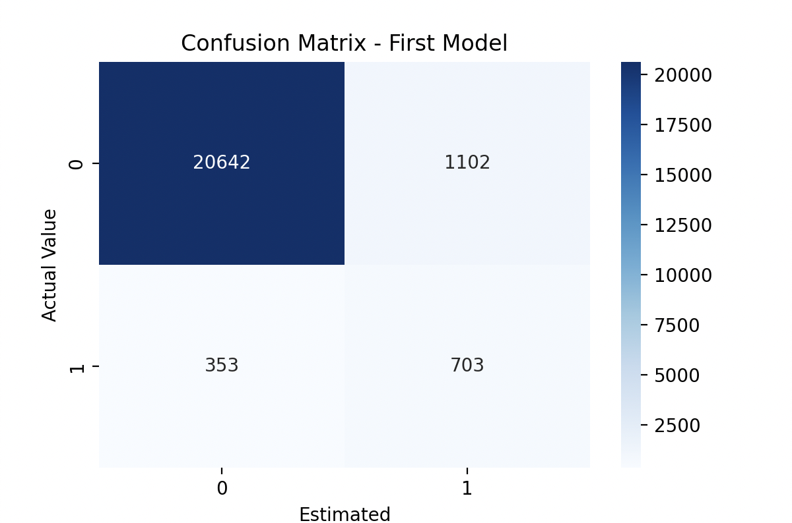
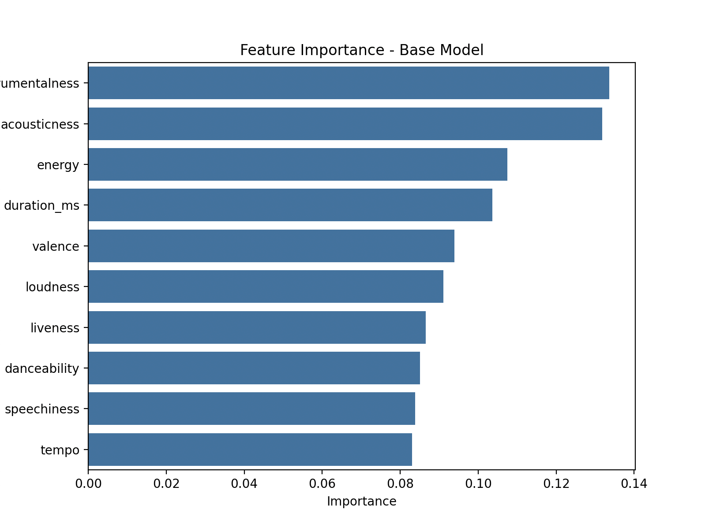
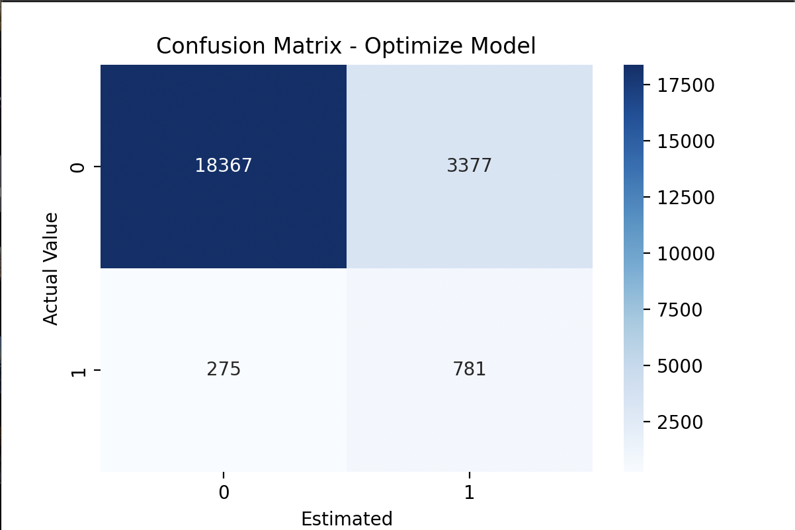

# 🎧 Spotify Hit Prediction using Machine Learning

This project explores the prediction of hit songs on Spotify using machine learning techniques. By analyzing a dataset of over 114,000 songs and leveraging Random Forest classification, we aim to identify audio features that contribute to a song's potential popularity.

---

## 📊 Project Summary

| Category        | Description                                                        |
|----------------|--------------------------------------------------------------------|
| 📁 Dataset      | 114,000 tracks from Spotify with audio and metadata features       |
| 🎯 Goal         | Predict whether a song is a "hit" based on its popularity score   |
| 📌 Target Class | Binary classification: Hit (popularity ≥ 70) vs. Not Hit          |
| ⚙️ Model        | Random Forest Classifier (optimized with GridSearchCV)             |
| 🧪 Metrics       | Accuracy, Precision, Recall, F1-Score, Confusion Matrix           |

---

## 📁 Directory Structure

```
spotify-hit-prediction/
├── spotify_analysis.py
├── dataset.csv
├── README.md
├── requirements.txt
├── results/
│   ├── aftersmote.png
│   ├── featureimportance.png
│   ├── matrixfirstmodel.png
│   └── optimizedmodel.png
```

---

## 🧾 Features Used for Training

- `danceability`
- `energy`
- `loudness`
- `speechiness`
- `acousticness`
- `instrumentalness`
- `liveness`
- `valence`
- `tempo`
- `duration_ms`

> These were selected due to their importance in the literature and confirmed via feature importance analysis.

---

## ⚙️ Data Preprocessing

- Missing values removed using `dropna()`
- `explicit` converted to integer
- Unused metadata columns removed
- Target label (`hit`) created: `1` if `popularity >= 70`, else `0`

---

## ⚖️ Handling Class Imbalance (SMOTE)

**Before SMOTE:**
- Not Hit: 86,783  
- Hit: 4,416

**After SMOTE:**
- Not Hit: 86,783  
- Hit: 86,783

| Class Distribution After SMOTE |
|:------------------------------:|
|  |

---

## 🧠 Base Model Performance

| Metric     | Value |
|------------|-------|
| Accuracy   | 93.6% |
| Precision  | 0.39  |
| Recall     | 0.67  |
| F1-Score   | 0.49  |

| Confusion Matrix - Base Model |
|:-----------------------------:|
|  |

---

## 📈 Feature Importance

| Feature Importance - Base Model |
|:-------------------------------:|
|  |

Top predictors:
- Instrumentalness
- Acousticness
- Energy
- Duration (ms)

---

## 🔍 Model Optimization (GridSearchCV)

**Tuned Hyperparameters:**
- `n_estimators`: [100, 200]
- `max_depth`: [10, 20]
- `min_samples_split`: [2, 5]

**Best Parameters:**  
```json
{ "n_estimators": 200, "max_depth": 20, "min_samples_split": 2 }
```

---

## 🚀 Optimized Model Results

| Metric     | Value |
|------------|-------|
| Accuracy   | 83.9% |
| Precision  | 0.19  |
| Recall     | 0.74  |
| F1-Score   | 0.30  |

> ⚠️ Precision dropped due to prioritizing recall for the minority class (hit songs), increasing false positives.

| Confusion Matrix - Optimized Model |
|:----------------------------------:|
|  |

---

## 🧪 Cross Validation (Base Model)

**5-Fold Accuracy Scores:**

```text
[0.9754, 0.9768, 0.9682, 0.9726, 0.9750]
Mean: 0.9736
```

---

## 📥 How to Run

1. Clone the repository:
```bash
git clone https://github.com/yourusername/spotify-hit-prediction.git
cd spotify-hit-prediction
```

2. Install dependencies:
```bash
pip install -r requirements.txt
```

3. Run the script:
```bash
python spotify_analysis.py
```

---

## 📚 References

- Kim, H., Lee, S., & Choi, M. (2018). *Predicting hit songs: Logistic regression with Spotify data*. Journal of Music Analytics, 45(3), 123–135.
- Lee, J., & Park, M. (2019). *Neural network approaches for music popularity prediction*. ISMIR.
- Sun, Y., Wu, X., & Zhao, L. (2020). *Ensemble learning for music classification*. Journal of Data Science, 58(7), 311–325.
- Zhang, Y., & Li, P. (2021). *Feature importance in hit prediction: A decision tree approach*. Journal of Computational Musicology, 18(2), 87–101.
- Brown, T., Smith, K., & Lee, J. (2022). *Data balancing techniques for hit prediction*. Machine Learning in Music Applications, 12(1), 45–58.

---

## 👤 Author

Kaan Akboğa**  
GitHub: [@kaanakboga](https://github.com/kaanakboga)
